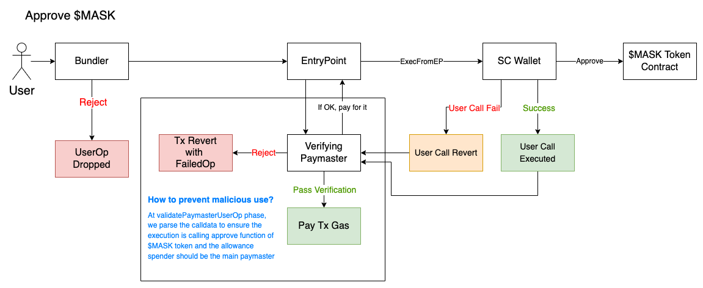

# Workflow

## Workflow of Entire System

The above is a sequence diagram which could describe the general idea of how paymaster work in the ERC-4337 system.

- Before each paymaster starts work, they need to deposit and stake in EntryPoint contract.
- During the verification loop (before EntryPoint contract handle the UserOperation), the system will check:

  - if paymaster has enough stake in EntryPoint.
  - if paymaster is willing to pay for this UserOperation.
  - if the validation of UserOperation is passed in SC Wallet (Smart Contract Wallet).

- After the verification loop, the sponsor will help send the execution transaction through EntryPoint contract.
- Then, sponsor and EntryPoint will get payback in `postOp()` of paymaster contract.

## Detail of Paymaster

According to the [official doc of ERC-4337](https://eips.ethereum.org/EIPS/eip-4337#simulation),

> While simulating `op` validation, the client should make sure that `paymaster.validatePaymasterUserOp` does not access mutable state of any contract except the paymaster itself.

We need some special design for ERC-20 paymaster to avoid violating the condition. Our solution is to use deposit mechanism and also create two paymaster (the two paymasters could be on implementation level or just conception level).

Currently, we divided the entire work flow into two main parts: preparation stage and execution stage.

The following workflow diagrams illustrate these two stage in detail.

### Preparation Stage

We hope to give user an entirely gas-free procedure, thus, we have a `verifying paymaster` to help gasless user approve their ERC-20 token ($MASK will be the example token in the following sections).

`Verifying paymaster` could sponsor transaction for qualified users with supported operation. Here, this paymaster will be used in the operations: `approve()`. This operation should be done in advance (especially for first-time user). Here, we must pay attention to the malicious attack targeting our verifying paymaster since we sponsor users for free. Our solution is to parse `callData` in `UserOperation` to ensure it only sponsor the supported operation. Check [data structure of `UserOperation.callData`](callDataField.md)

### Execution Stage

As stated in the former section, we use deposit mechanism. In this mechanism, every SC wallet should have enough deposit balance before execution stage. In our case, we plan to cover the deposit fee for user. For qualified users, we will deposit for them in advance. Then, users with enough deposit balance in our paymaster is eligible to perform their `UserOperation` via our $MASK paymaster.

If the execution is completed successfully, paymaster will call `transferFrom()` in $MASK token contract to transfer $MASK for gas fee directly. If paymaster fail to get paid, they'll decrease the deposit balance instead.

In the entire process, user may face three major exceptional condition.

- User does not complete the preparation stage or their deposit is not enough: Our $MASK paymaster will reject to pay for this `UserOperation`.

- User call in `UserOperation` execution is failed: user still have to pay for their failed operation. $MASK paymaster will call $MASK token contract to transfer corresponding token amount from user's contract wallet.

- `postOp()` execution is failed: paymaster cannot get paid in `postOp()`. It will reduce the deposit of this user as a substitute.

For token exchange (i.e. $ETH-$MASK), we decided to use a script to periodically update the token swap ratio to keep a relatively stable exchange ratio and also reduce the gas cost for instant token exchange.

**NOTE**: For `opReverted` mode and `postOpReverted` mode, the effect caused by user call in `UserOperation` will be reverted even though the entire tx won't be reverted.
