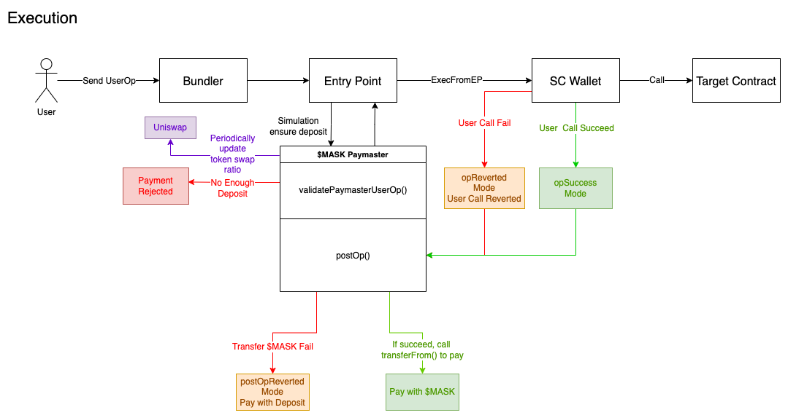

# Workflow

Before dive deep into the detail about workflow of PayGasX, it would be better to know the general structure of the proposal [EIP-4337](https://eips.ethereum.org/EIPS/eip-4337) in advance.

## State in EIP-4337

Understanding the state transition in EIP-4337 could help you understand our workflow better.

Since the new data structure `UserOperation` is introduced in EIP-4337, only two status of transaction (i.e. failure and success of a transaction) cannot describe the status of `UserOperation` precisely. We should know a new condition: **Transaction succeed, but the original user call is reverted**. With this status, our system is able to get paid even though the user call fails.

Check [try/catch mechanism in solidity](https://docs.soliditylang.org/en/v0.8.17/control-structures.html?highlight=try#try-catch) for more detail.

## Details of SimpleWallet

Transactions can be executed directly by the owner through `exec(address, uint256, bytes)`, or from EntryPoint `execFromEntryPoint(address, uint256, bytes)`.

- Calling `exec()` directly require the owner address to hold sufficient coins to pay for the GAS fees, the wallet will behave like normal smart contract wallet when used this way.
- An alternative way to achieve GAS-less transaction is to sponsor the transaction by pre-deposit the fees into EntryPoint contract by calling `addDeposit() payable`. The user will have to sign an userOperation and get a Bundler to execute it from the EntryPoint.

The two methods will achieve the same result.

## Detail of ERC20 Paymaster

There are two main parts in the entire gas fee payment of a `UserOperation` with paymaster sponsor: transaction sender payment and gas fee compensate.

- Bundler sends the transaction to call `EntryPoint` with `UserOperation` and pay for the transaction gas fee.
- User pays gas fee to paymaster in post-operation stage using the payment supported by the paymaster which is specified in `UserOperation`.
- `EntryPoint` compensates bundler with the gas fee and reduce the deposit of this paymaster.

To make the entire progress work fine, we should guarantee every participant get paid what they are supposed to. The following is the detail of our solution for ERC20 Paymaster.

According to the [official doc of ERC-4337](https://eips.ethereum.org/EIPS/eip-4337#simulation),

> While simulating `op` validation, the client should make sure that `paymaster.validatePaymasterUserOp` does not access mutable state of any contract except the paymaster itself.

Paymaster is not able to check the ERC20 token balance of an account before it approves one payment, so we choose to use the deposit mechanism.

To ensure our paymaster could transfer ERC20 token from users' 4337 contract wallet, our 4337 contract wallet will approve the gas token to paymaster during its creation.

### Preparation Stage

In our deposit mechanism, ERC20 token paymaster is willing to approve the payment only when user has enough deposit (to pay for the gas fee of this `UserOperation`). Thus, there is an `addDepositFor()` operation before the real execution of a `UserOperation`.

In our case, we plan to cover the deposit fee for user. For qualified users, we will add the "deposit" (in current stage, it's more like a credit ledger) for them in advance through our API. Then, users with enough deposit is eligible to perform their `UserOperation` via our $MASK paymaster in execution stage.

#### Future Work

We plan to make `addDepositFor()` public to allow more user participate and have a try on this paymaster in future stage. At that time, users need to add deposit by themselves.

### Execution Stage

If the execution is completed successfully, paymaster will call `transferFrom()` in $MASK token contract to transfer $MASK for gas fee directly. If paymaster fail to get paid, they'll decrease the deposit balance instead.

In the entire process, user may face three major exceptional condition.

- User's deposit is not enough: Our $MASK paymaster will reject to pay for this `UserOperation`.

- User call in `UserOperation` execution is failed: user still have to pay for their failed operation. $MASK paymaster will call $MASK token contract to transfer corresponding token amount from user's contract wallet.

- `postOp()` execution is failed: paymaster cannot get paid in `postOp()`. It will reduce the deposit of this user as a substitute.

For token exchange (i.e. $ETH-$MASK), we decided to use a script to periodically update the token swap ratio to keep a relatively stable exchange ratio and also reduce the gas cost for instant token exchange.

**NOTE**: For `opReverted` mode and `postOpReverted` mode, the effect caused by user call in `UserOperation` will be reverted even though the entire tx won't be reverted.
